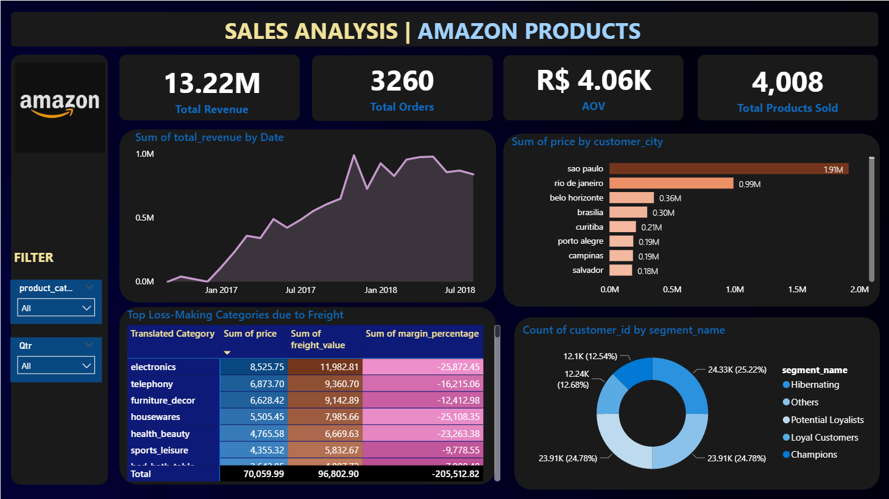
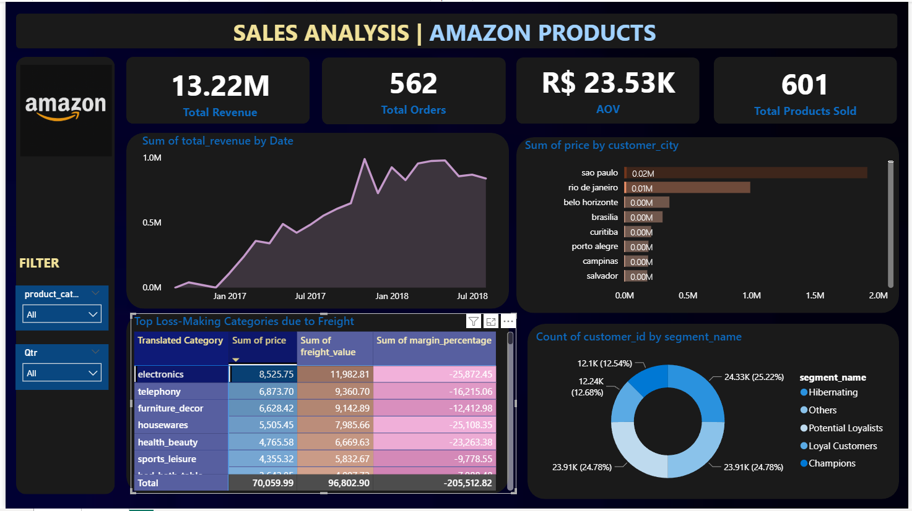

# E-commerce Data Analysis with PySpark and Power BI

This project provides a comprehensive analysis of the Olist E-commerce dataset from Kaggle. Apache Spark (via PySpark) was used for processing and analyzing the large dataset. The resulting insights were then visualized using an interactive Power BI dashboard.

**The primary business goal of this analysis is to help e-commerce companies understand customer behavior, track key revenue metrics, and identify the most profitable cities and products.**

---

## 🚀 Workflow & Key Insights

The project followed a structured workflow from data processing to final visualization. Below are the key stages and the most important insights discovered in each.

### 1. Data Processing & Cleaning
*   **Action:** Merged 6 different datasets (orders, items, customers, etc.) into a single, unified view.
*   **Action:** Handled missing values and filtered the data to include only 'delivered' orders to ensure analysis accuracy.

### 2. Exploratory & Financial Analysis
*   **Insight:** The city of **Sao Paulo** is the top-performing city, generating the highest total revenue.
*   **Insight:** Identified the top 10 most expensive products sold, providing focus for high-value item marketing.
*   **Insight:** Calculated profit margins for orders, revealing a subset of orders with negative margins that require further investigation.

### 3. Advanced Analysis: Customer Segmentation (RFM)
*   **Action:** Applied the RFM (Recency, Frequency, Monetary) model to score customers based on their purchasing behavior.
*   **Insight:** Segmented customers into distinct groups such as **"Champions"** (best customers), **"Loyal Customers"**, **"At Risk"**, and **"Hibernating"**. This allows for targeted marketing campaigns for each segment.

### 4. Exporting for Visualization
*   **Action:** The results of each analysis (e.g., monthly revenue, RFM segments) were saved into clean CSV files located in the `data/` directory.
*   **Purpose:** These files serve as a direct and efficient data source for the Power BI dashboard.

---

## 🛠️ Tech Stack
*   **Data Processing & Analysis:** Python, PySpark, Pandas
*   **Data Visualization:** Power BI
*   **Environment:** Jupyter Notebook in VS Code

---

## ⚙️ Usage and Installation

To run this project locally, follow these steps:

1.  **Clone the repository:**
    ```bash
    git clone https://github.com/AyaatMohammed/Amazon-Sales-Analysis-PySpark.git
    cd Amazon-Sales-Analysis-PySpark
    ```

2.  **Create and activate a virtual environment (recommended ):**
    ```bash
    python -m venv venv
    source venv/bin/activate  # On Windows, use `venv\Scripts\activate`
    ```

3.  **Install the required dependencies:**
    *Make sure you have Java installed for PySpark to run correctly.*
    ```bash
    pip install -r requirements.txt
    ```

4.  **Run the Jupyter Notebook:**
    ```bash
    jupyter notebook "Advanced E-commerce Analytics with PySpark .ipynb"
    ```

5.  **Connect to Power BI:**
    *   Open Power BI Desktop.
    *   Use the "Get Data" -> "Text/CSV" option.
    *   Navigate to the `data/` folder in this project and select the desired CSV files (e.g., `rfm_customer_segments.csv`) to build your visualizations.

---

## 📊 Power BI Dashboard

The final step was to visualize these findings. The following screenshots are from the final dashboard built in Power BI.

### 1. General Overview
*This view shows the overall performance metrics across all data, including total revenue, number of orders, and customer segments.*


### 2. Loss-Making Categories Analysis
*By filtering the data, the dashboard can identify specific product categories that are generating a negative profit margin, highlighting areas for business improvement.*


---

## 🔮 Future Work

This project provides a solid foundation. Future enhancements could include:

*   **Time Series Forecasting:** Building a model to predict future revenue or sales.
*   **Churn Prediction Model:** Developing a machine learning model to identify customers who are likely to stop purchasing.
*   **Product Recommendation System:** Implementing a basic recommendation engine to suggest products to users.
*   **Automated Data Pipeline:** Using a tool like Apache Airflow to automate the entire analysis workflow to run on a schedule.

---

---

## 📬 Contact Me

Created by **Ayaat Mohammed**. Feel free to reach out!

[](https://www.linkedin.com/in/ayat-mohammed-b58856361 )
[](https://github.com/AyaatMohammed )
